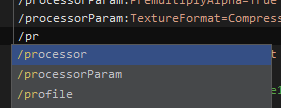
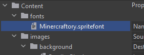
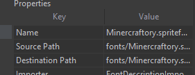
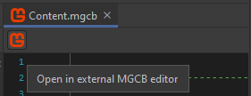
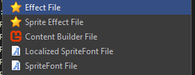

  <h1>MonoGame plugin for JetBrains Rider</h1>
  
    
  This plugin improves MonoGame usage experience inside JetBrains Rider.
    
  

[//]: # (  )

---

  <h3>MGCB file editing</h3>

  
  <h3>Autocomplete and syntax highlighting</h3>
  All supported MGCB options properly highlighted and could be autocompleted

  

  
  <h3>Build entries previewer</h3>
  See all your assets in a realtime tree view according to their declarations

  

  
  <h3>Table view for a build entry properties</h3>
  Review build entry properties and processor parameters in a table representation

  

  
  <h3>Open in external MGCB editor action</h3>
  Jump to external MGCB editor GUI in one click

 

  <h3>Other</h3>

  
  <h3>Additional file templates</h3>

Easily create MonoGame related assets using file templates under Add menu

 

---

### How to install

#### Using marketplace:

[//]: # (> **For EAP users**: you should add `https://plugins.jetbrains.com/plugins/eap/list` to your plugin repositories list before installing)

1. Go to `Settings` / `Plugins` / `Marketplace`
1. Search for "MonoGame"
1. Click `Install`, then `Save`
1. After saving restart Rider

#### Using `.zip` file
1. Go to [**Releases**](https://github.com/seclerp/rider-monogame/releases)
2. Download the latest release of plugin for your edition of JetBrains Rider (Stable or EAP)
3. Proceed to `Settings` / `Plugins` / `⚙` / `Install plugin from disk`
4. Click `Save`
5. After saving restart Rider

### How to use

Just open .mgcb file for editing. Previewer will be on the right side of the editor.

Additional file templates are located under <kbd>Add</kbd> section of a folder or project context menu.

### Requirements

- JetBrains Rider **2022.1+**
<!-- or JetBrains Rider **2021.3 EAP10** -->

- Project with MonoGame installed (**3.8+ is recommended**)  

> **Note**: Projects with older versions of MonoGame might work, but with issues

### Development

> **Note**: You should have JDK 11 and .NET SDK 5.0+ installed and configured.

#### Preparing

`./gradlew rdgen` - generates RD protocol data for plugin internal communication

#### Building plugin parts

- for stable version of Rider:

  `./gradlew buildPlugin`

- for EAP version of Rider:

  `./gradlew buildPlugin -PRiderSdkVersion=2021.3.0-eap10 -PProductVersion=2021.3-EAP10-SNAPSHOT`

It will build both frontend and backend parts.

#### Running

Next command will start instance of JetBrains Rider with plugin attached to it:

`./gradlew runIde`

### Contributing

Contributions are welcome! 🎉

It's better to create an issue with description of your bug/feature before creating pull requests.

#### About branching

This project uses modified version of **trunk-based git strategy**.

- `develop` branch play main development branch role. When creating any feature or bugfix, please make your branch from `develop`.

- `master` branch stands for stable releases. `develop` branch will be merged into it before every release.
- `eap` branch stands for EAP release. `develop` branch will be also merged into it before every release (if EAP build of Rider is available to use)

### See also

- [**Marketplace page**](https://plugins.jetbrains.com/plugin/18415-monogame)
- [**Changelog**](CHANGELOG.md)
